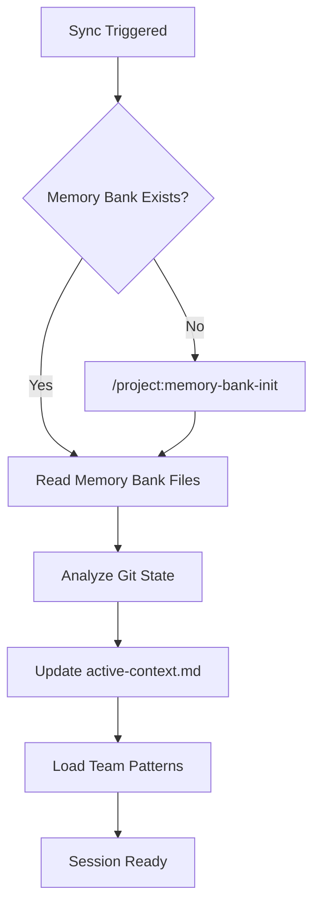

# Memory Bank Sync

Synchronize the Claude Code Memory Bank with current git state and project context for session continuity.

## Command Usage
```bash
/project:memory-bank-sync
```

## Sync Purpose

This command performs lightweight synchronization to:
- Load current memory bank context at session start
- Sync with git repository state changes
- Update immediate working context without full analysis
- Prepare for continued development work
- Validate memory bank integrity

## Sync Process

### 1. **Memory Bank Validation**
**Verify memory bank exists and is accessible:**

```bash
# Check memory bank directory structure
ls -la .claude/memory-bank/

# Verify required files exist
required_files=(
    "project-context.md"
    "active-context.md"
    "progress-tracker.md"
    "decision-log.md"
    "patterns-learned.md"
)
```

**If memory bank missing:** Automatically trigger `/project:memory-bank-init`

### 2. **Git State Analysis**
**Analyze current repository state:**

```bash
# Current branch and status
git status --porcelain
git branch --show-current

# Recent commits since last memory bank update
git log --oneline -10

# Uncommitted changes
git diff --name-only
git diff --cached --name-only
```

**Document findings:**
- Current branch context
- Uncommitted changes requiring attention
- Recent commits that may affect context
- Any merge conflicts or git issues

### 3. **Quick Context Update**
**Update only time-sensitive information:**

#### Sync `active-context.md`
- Update current date and session start time
- Refresh current branch information
- Note any urgent git status changes
- Update immediate working directory state
- Record any blocking issues discovered

#### Light Update to `progress-tracker.md`
- Mark any obviously completed tasks
- Note new urgent priorities
- Update current milestone status
- Record any critical deadlines

### 4. **Pattern Recognition Check**
**Quick scan for new patterns:**
- Review recent commits for naming conventions
- Check for new file structures or organization
- Note any obvious coding pattern changes
- Identify new tools or dependencies

### 5. **Session Preparation**
**Prepare optimal working context:**
- Load relevant code patterns from memory bank
- Prepare team conventions and preferences
- Set up expected workflows and standards
- Prime context with current technical stack

## Sync vs Update Comparison

| Aspect            | Memory Bank Sync                       | Memory Bank Update              |
| ----------------- | -------------------------------------- | ------------------------------- |
| **Frequency**     | Session start, git changes             | Major milestones, session end   |
| **Depth**         | Lightweight, focused                   | Comprehensive, deep analysis    |
| **Thinking Mode** | Standard                               | "ultrathink" required           |
| **Files Updated** | active-context.md, progress-tracker.md | ALL memory bank files            |
| **Git Analysis**  | Current state only                     | Full history analysis           |
| **Duration**      | Quick (1-2 minutes)                    | Thorough (5-10 minutes)         |
| **Purpose**       | Load context, continue work            | Preserve context, prepare reset |

## Implementation Steps

### 1. **Validate Memory Bank**
```bash
# Check if memory bank exists
if [ ! -d ".claude/memory-bank" ]; then
    echo "Memory bank not found. Initializing..."
    /project:memory-bank-init
    return
fi
```

### 2. **Read Current Memory Bank**
**Load all memory bank files to understand current context:**
- Read project-context.md for overall understanding
- Read active-context.md for immediate context
- Review patterns-learned.md for team conventions
- Check technical-stack.md for current technology state

### 3. **Git Analysis**
```bash
# Capture current git state
CURRENT_BRANCH=$(git branch --show-current)
GIT_STATUS=$(git status --porcelain)
RECENT_COMMITS=$(git log --oneline -5)
UNCOMMITTED_FILES=$(git diff --name-only)
```

### 4. **Context Synchronization**
**Update active-context.md with current state:**
```markdown
## Current Session Context
- **Date**: $(date)
- **Branch**: $CURRENT_BRANCH
- **Git Status**: $GIT_STATUS
- **Recent Commits**: $RECENT_COMMITS
- **Working Files**: $UNCOMMITTED_FILES

## Immediate Priorities
- [Load from previous active-context.md]
- [Add any urgent git-related priorities]

## Session Goals
- [Continue previous work or start new tasks]
```

### 5. **Load Team Patterns**
**Apply learned patterns from memory bank:**
- Coding conventions and standards
- Testing approaches and frameworks
- Git workflow preferences
- Documentation standards
- Team communication patterns

## Sync Workflow



## Automatic Sync Triggers

Memory bank sync automatically triggers on:
- **Session Start**: When starting Claude Code in a project
- **Branch Switch**: When git branch changes detected
- **Pull/Merge**: After git pull or merge operations
- **New Files**: When significant new files are detected
- **Manual Request**: When explicitly requested

## Quick Sync Checklist

- [ ] **Memory bank directory exists**
- [ ] **All required files are present**
- [ ] **Git status analyzed and documented**
- [ ] **Current branch context loaded**
- [ ] **active-context.md updated with session info**
- [ ] **Team patterns and conventions loaded**
- [ ] **Immediate priorities identified**
- [ ] **Session goals established**

## Sync Validation

After sync completion, verify:
1. **Active context is current** with today's date and correct branch
2. **Git state is accurately reflected** in documentation
3. **Team patterns are loaded** and ready to apply
4. **Immediate priorities are clear** and actionable
5. **No memory bank corruption** or missing files

## Performance Optimization

For large repositories:
- **Focus on recent changes** (last 10 commits)
- **Limit file analysis** to modified files only
- **Cache git analysis** results when possible
- **Use incremental updates** rather than full reads

**Remember**: Sync is designed for speed and continuity. Use `/project:memory-bank-update` for comprehensive analysis and documentation. Use sync to quickly load context and continue productive development work.
