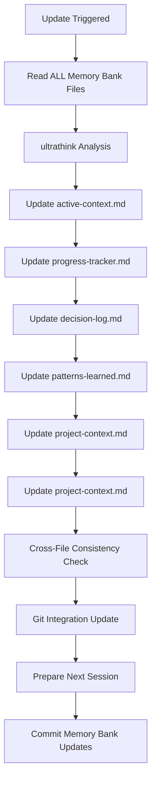

# Memory Bank Update

Comprehensively update the Claude Code Memory Bank system with current project state, new patterns, and recent changes.

## Command Usage
```bash
/project:memory-bank-update
```

## Update Process

### 1. **Pre-Update Analysis**
**CRITICAL: This command means imminent memory reset - document EVERYTHING**

- Read ALL existing memory bank files
- Analyze current git status and recent commits
- Review conversation history for new patterns or decisions
- Assess project state changes since last update
- Identify new learning opportunities

### 2. **Enhanced Context Analysis**
**Use "ultrathink" mode for comprehensive understanding:**

```
ultrathink about the current project state, recent changes, patterns learned, 
and any new architectural decisions or team preferences discovered
```

**Analyze systematically:**
- Code changes since last update
- New patterns or conventions adopted
- Architectural decisions made
- Team preferences discovered
- Problems solved and solutions found
- Technical debt identified or resolved

### 3. **Memory Bank File Updates**

#### Update `project-context.md`
**Current project understanding:**
- Refresh project overview with any scope changes
- Update feature list with new functionality
- Revise success metrics if changed
- Document any domain knowledge gained
- Update stakeholder or user information
**Technology and architecture changes:**
- Add any new dependencies or tools
- Update architecture diagrams or descriptions
- Document new patterns or frameworks adopted
- Note performance optimizations made
- Record infrastructure or deployment changes

#### Update `active-context.md`
**MOST CRITICAL - Current working state:**
- Document exactly what was being worked on
- Capture current implementation progress
- Note immediate next steps and priorities
- Record any blocking issues or concerns
- Update current branch and feature context
- Document any temporary states or work-in-progress

#### Update `progress-tracker.md`
**Project advancement:**
- Mark completed milestones and features
- Update percentage completion estimates
- Document new tasks discovered
- Revise timeline estimates if needed
- Note any scope changes or pivots

#### Update `decision-log.md`
**Architectural and technical decisions:**
- Record all significant decisions made this session
- Document the reasoning behind choices
- Note alternatives considered and rejected
- Update any previous decisions that changed
- Include context for future reference

#### Update `patterns-learned.md`
**Team and project patterns:**
- Document new coding patterns discovered
- Update team preferences and conventions
- Record successful problem-solving approaches
- Note any anti-patterns to avoid
- Update development workflow insights

### 4. **Cross-File Consistency Check**

**Ensure coherence across all files:**
- Verify dates and contexts align
- Check that technical decisions are consistently reflected
- Ensure progress tracking matches active context
- Validate that patterns align with recent code changes
- Confirm no contradictory information exists

### 5. **Git Integration Update**

**Sync with version control:**
- Analyze recent commits for context clues
- Update branch tracking information
- Document any merge conflicts or resolutions
- Note any significant refactoring or architectural changes
- Record deployment or release information

### 6. **Next Session Preparation**

**Prepare for memory reset:**
- Make next steps crystal clear and actionable
- Document any context that would be lost
- Note any files or areas requiring attention
- Record any ongoing debugging or investigation
- Set clear priorities for next session

## Critical Update Triggers

Execute memory bank update when:
- **Manual Request**: User explicitly asks to "update memory bank"
- **Context Window Full**: Approaching token limits (~2M tokens)
- **Major Milestones**: Significant features completed
- **Architectural Changes**: Major refactoring or design decisions
- **Session End**: Before ending a productive development session
- **Problem Resolution**: After solving complex technical challenges

## Update Workflow



## Implementation Guidelines

### Memory Bank Update Checklist
- [ ] **Read all existing memory bank files completely**
- [ ] **Use ultrathink for comprehensive analysis**
- [ ] **Update active-context.md with current state**
- [ ] **Document all decisions in decision-log.md**
- [ ] **Record new patterns in patterns-learned.md**
- [ ] **Update progress-tracker.md with completions**
- [ ] **Refresh technical-stack.md with changes**
- [ ] **Verify cross-file consistency**
- [ ] **Sync with git status and history**
- [ ] **Prepare clear next steps**
- [ ] **Commit memory bank changes**

### Quality Standards
- **Comprehensive**: Cover all significant changes and learnings
- **Specific**: Include concrete examples and code references
- **Actionable**: Make next steps clear and executable
- **Consistent**: Maintain coherence across all files
- **Current**: Reflect the absolute latest project state

### Error Prevention
- **Always read all files before updating**
- **Never skip ultrathink analysis for complex situations**
- **Verify git status before documenting changes**
- **Double-check that next steps are clear**
- **Ensure active-context.md is completely current**

## Post-Update Validation

After completing updates:
1. **Review active-context.md** for clarity and completeness
2. **Verify next steps** are actionable and specific
3. **Check decision-log.md** for new architectural choices
4. **Confirm patterns-learned.md** reflects recent discoveries
5. **Validate git sync** shows current repository state

**Remember**: This update prepares the memory bank for a complete memory reset. Every critical piece of context must be captured with precision and clarity to ensure seamless continuation in the next session.
