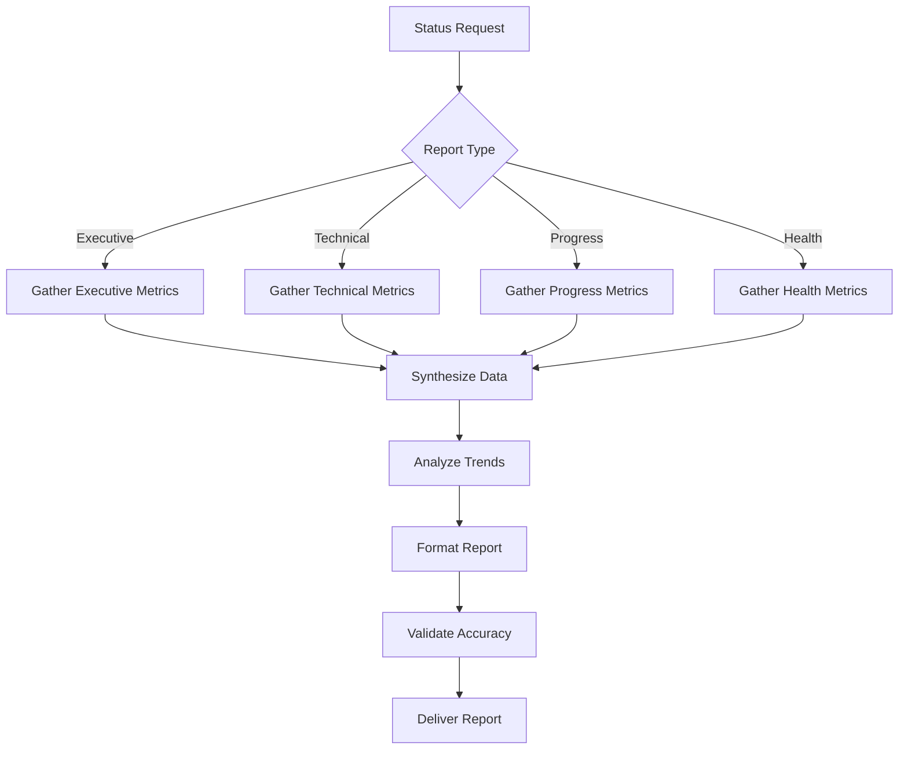

# Project Status Report

Generate a comprehensive status report combining memory bank intelligence, git analysis, and current project state assessment.

## Command Usage
```bash
/project:project-status [report-type]
```

**Report Types:**
- `executive` - High-level summary for stakeholders
- `technical` - Detailed technical status for developers
- `progress` - Milestone and completion tracking
- `health` - Code quality and technical debt assessment
- `team` - Team productivity and collaboration metrics

## Status Report Generation

### 1. **Memory Bank Intelligence Synthesis**
**Consolidate all memory bank knowledge:**

- Read and synthesize ALL memory bank files
- Extract key project metrics and progress indicators
- Identify current priorities and active work streams
- Compile technical decisions and architectural choices
- Gather team patterns and learned preferences

### 2. **Real-Time Project Analysis**
**Analyze current project state:**

```bash
# Git repository analysis
git log --oneline --graph --all -20
git status --porcelain
git branch -av
git tag --sort=-version:refname | head -10

# Code metrics (if tools available)
find . -name "*.js" -o -name "*.ts" -o -name "*.py" -o -name "*.java" | wc -l
git log --format='%aN' | sort -u | wc -l
git log --since="1 month ago" --pretty=format:"%h %s" | wc -l

# Project structure analysis
tree -L 3 -I 'node_modules|.git|.cache'
```

### 3. **Multi-Dimensional Status Assessment**

#### **Progress Tracking**
- **Completed Milestones**: Features and tasks finished
- **Active Development**: Current work in progress  
- **Upcoming Priorities**: Next planned work items
- **Blocked Items**: Issues preventing progress
- **Timeline Assessment**: Project schedule adherence

#### **Technical Health**
- **Code Quality Metrics**: Complexity, maintainability, coverage
- **Technical Debt Level**: Identified debt and remediation status
- **Dependency Status**: Package updates, security vulnerabilities
- **Performance Metrics**: Build times, test execution, response times
- **Architecture Alignment**: Adherence to architectural principles

#### **Team Productivity**
- **Velocity Metrics**: Commit frequency, feature completion rate
- **Collaboration Patterns**: Code review activity, pair programming
- **Knowledge Distribution**: Bus factor, expertise areas
- **Process Efficiency**: Workflow bottlenecks, automation gaps
- **Quality Indicators**: Bug rates, test coverage, documentation completeness

### 4. **Status Report Templates**

#### Executive Summary Report
```markdown
# Project Status Executive Summary

**Report Date**: $(date)  
**Project**: [Project Name]  
**Phase**: [Current Development Phase]

## 🎯 Key Highlights
- **✅ Major Achievements**: [Recent significant completions]
- **🚀 Current Focus**: [Active development priorities]
- **⚠️ Key Risks**: [Issues requiring attention]
- **📊 Progress**: [X]% complete against milestones

## 📈 Progress Overview
| Milestone | Status | Completion | Notes |
|-----------|--------|------------|-------|
| [Milestone 1] | ✅ Complete | 100% | [Key details] |
| [Milestone 2] | 🚧 In Progress | 75% | [Current status] |
| [Milestone 3] | 📋 Planned | 0% | [Target date] |

## 🔍 Health Indicators
- **Technical Health**: [Green/Yellow/Red] - [Brief explanation]
- **Team Velocity**: [Trend indicators]
- **Code Quality**: [Quality metrics summary]
- **Risk Level**: [Overall risk assessment]

## 🎪 Next 30 Days
- [Priority 1 with timeline]
- [Priority 2 with timeline]
- [Priority 3 with timeline]

## 💡 Recommendations
- [Key recommendation 1]
- [Key recommendation 2]
```

#### Technical Status Report
```markdown
# Technical Status Report

## 🏗️ Architecture & Design
- **Current Architecture**: [Architecture pattern in use]
- **Recent Changes**: [Significant architectural updates]
- **Technical Decisions**: [Key decisions from decision-log.md]
- **Compliance**: [Standards and pattern adherence]

## 📊 Code Quality Metrics
- **Test Coverage**: [X]% ([trend])
- **Code Complexity**: [Complexity metrics]
- **Technical Debt**: [Debt level and trends]
- **Documentation**: [Coverage and quality assessment]

## 🚀 Performance Status
- **Build Performance**: [Build time trends]
- **Test Execution**: [Test suite performance]
- **Runtime Performance**: [Application performance metrics]
- **Resource Usage**: [Memory, CPU, storage trends]

## 🔧 Technical Infrastructure
- **Dependencies**: [Package status, vulnerabilities]
- **Development Environment**: [Tool status, configuration]
- **CI/CD Pipeline**: [Build success rates, deployment frequency]
- **Monitoring**: [Error rates, uptime, alerts]

## 🔍 Active Issues
- **High Priority**: [Critical issues requiring immediate attention]
- **Medium Priority**: [Important issues for next iteration]
- **Technical Debt**: [Debt items scheduled for remediation]
- **Enhancement Requests**: [Planned improvements]

## 📅 Technical Roadmap
- **Next Sprint**: [Technical priorities]
- **Next Month**: [Medium-term technical goals]
- **Next Quarter**: [Strategic technical initiatives]
```

#### Progress Tracking Report
```markdown
# Progress Tracking Report

## 📊 Milestone Progress
[Visual progress bars or percentage completions]

## 🏃‍♂️ Velocity Metrics
- **Commits per Week**: [Average and trend]
- **Features per Sprint**: [Completion rate]
- **Bug Resolution Time**: [Average resolution time]
- **Code Review Cycle**: [Review and merge times]

## 📈 Trend Analysis
- **Productivity Trends**: [Team output over time]
- **Quality Trends**: [Bug rates, test coverage trends]
- **Complexity Trends**: [Codebase complexity evolution]
- **Knowledge Growth**: [Learning and skill development]

## 🎯 Goal Tracking
| Goal | Target Date | Progress | Status | Notes |
|------|-------------|----------|--------|-------|
| [Goal 1] | [Date] | [X]% | [Status] | [Details] |
| [Goal 2] | [Date] | [X]% | [Status] | [Details] |

## 🚧 Blockers & Risks
- **Current Blockers**: [Items preventing progress]
- **Risk Mitigation**: [Active risk management]
- **Dependency Tracking**: [External dependencies status]
```

### 5. **Automated Data Collection**

#### Git Analytics
```bash
# Commit activity analysis
git log --since="1 month ago" --pretty=format:"%aN" | sort | uniq -c | sort -nr

# Branch activity
git for-each-ref --format='%(refname:short) %(committerdate)' refs/heads | sort -k2

# File change frequency
git log --since="1 month ago" --name-only --pretty=format: | sort | uniq -c | sort -nr | head -20

# Contributor analysis
git shortlog -sn --since="1 month ago"
```

#### Project Metrics
```bash
# Code statistics
cloc . --exclude-dir=node_modules,.git,coverage,dist

# Dependency analysis
npm audit || pip-audit || dotnet list package --vulnerable

# Test coverage (if available)
npm run test:coverage || pytest --cov || dotnet test --collect:"XPlat Code Coverage"
```

## Report Generation Workflow



## Status Report Quality Standards

### Data Accuracy
- **Current Information**: All data reflects latest project state
- **Verified Metrics**: Numbers cross-checked against multiple sources
- **Context Provided**: Metrics include relevant context and trends
- **Clear Sources**: Data sources clearly identified

### Actionable Insights
- **Clear Recommendations**: Specific, actionable next steps
- **Prioritized Issues**: Problems ranked by impact and urgency
- **Resource Requirements**: Clear resource needs for recommendations
- **Timeline Estimates**: Realistic timelines for proposed actions

### Stakeholder Value
- **Audience-Appropriate**: Content tailored to report type and audience
- **Executive Summary**: Key points highlighted for quick consumption
- **Supporting Detail**: Detailed information available when needed
- **Visual Clarity**: Charts, graphs, and formatting aid comprehension

## Automated Reporting

### Scheduled Reports
- **Daily**: Basic metrics and health indicators
- **Weekly**: Progress tracking and velocity metrics
- **Monthly**: Comprehensive status with trends analysis
- **Quarterly**: Strategic assessment and roadmap updates

### Trigger-Based Reports
- **Milestone Completion**: Automatic progress reports
- **Issue Detection**: Health alerts and problem notifications
- **Performance Changes**: Automated performance trend analysis
- **Risk Escalation**: Risk threshold breach notifications

**Remember**: Status reports synthesize memory bank intelligence with real-time analysis to provide comprehensive project visibility. Use appropriate report types for different audiences and maintain regular reporting cadence for maximum value.