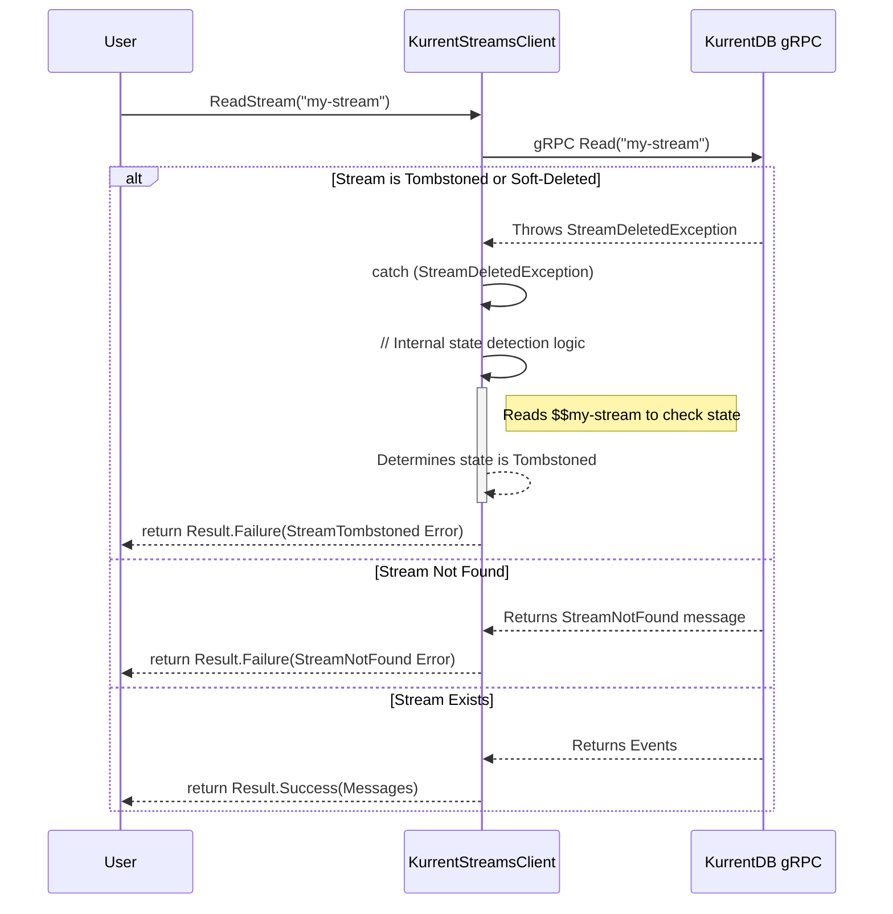
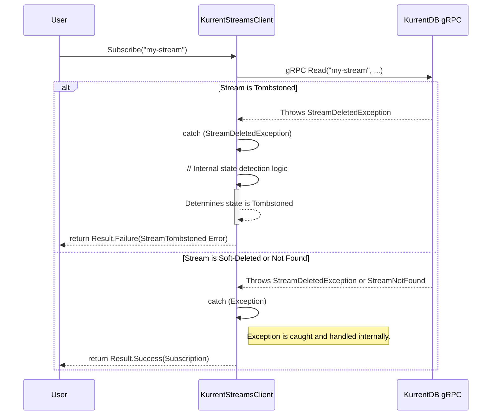

# KurrentDB .NET Client: Stream State Handling Analysis Report

> **Document Version**: 4.0 (Final)
> **Date**: 2025-07-25
> **Author**: Gemini
> **Status**: Final Report

## 1. The Problem: A Critical Flaw in the API's Error Contract

A deep-dive analysis has revealed a critical flaw in the KurrentDB .NET Client's implementation that results in a misleading and unreliable API contract for stream state errors. The client is fundamentally unable to distinguish between three distinct states:

1.  **Stream Never Existed**: A true `NotFound` state.
2.  **Stream was Soft-Deleted**: A recoverable state where the stream can be recreated.
3.  **Stream was Tombstoned**: A permanent, irreversible deletion.

Currently, the client incorrectly conflates these states, returning ambiguous errors that lie to the developer. For example, reading a soft-deleted stream can result in a `StreamNotFound` error, while reading a tombstoned stream results in a `StreamDeleted` error. This makes it impossible for a developer to build reliable, production-grade software that can react correctly to a stream's actual lifecycle state.

The most severe consequence of this flaw is a **silent failure mode in the subscription logic**. The code completely lacks error handling for deleted streams, causing subscriptions to fail silently without any notification, leaving the application in a hung state.

## 2. Root Cause: Incomplete Interpretation of Server Signals

The KurrentDB gRPC server sends a generic `StreamDeletedException` for both soft-deleted and tombstoned streams. The responsibility falls on the client to perform further investigation to disambiguate this signal. The server provides the necessary clues—a soft-deleted stream has a specific metadata setting (`$truncateBefore`), while a tombstoned stream has a permanent `$streamDeleted` event. The client's failure to interpret these clues is the root cause of this issue.

## 3. Affected Operations: A Component-by-Component Breakdown

This is a systemic issue that degrades the reliability of every stream-related operation.

### 3.1. Read Operations
-   **Affected Methods**: `ReadStream`, `ReadAll`, `ReadFirstStreamRecord`, `ReadLastStreamRecord`.
-   **The Flaw**: The client returns the wrong error. Reading a soft-deleted stream can incorrectly produce a `StreamNotFoundException`, while reading a tombstoned stream produces a `StreamDeleted` error.
    ```csharp
    // From KurrentStreamsClient.Read.cs -> ReadCore()
    catch (StreamDeletedException) {
        // TODO: THIS HAPPENS WHEN WE TOMBSTONE A STREAM - WE NEED A STREAM TOMBSTONED ERROR INSTEAD OF DELETED
        return Result.Failure<Messages, ReadError>(new StreamDeleted(...));
    }
    ```
-   **Impact**: This is profoundly misleading. A developer receiving `StreamNotFound` would reasonably assume the stream never existed, when in fact it did and could be recreated. Receiving `StreamDeleted` for a tombstoned stream hides the permanence of the deletion.

### 3.2. Subscription Operations
-   **Affected Methods**: `Subscribe`.
-   **The Flaw**: The subscription logic has no `catch` block for `StreamDeletedException`. It is completely unaware that a stream might be deleted.
    ```csharp
    // From KurrentStreamsClient.Subscriptions.cs -> SubscribeCore()
    try {
        await session.ResponseStream.MoveNext(stoppingToken).ConfigureAwait(false);
    }
    catch (AccessDeniedException) {
        return Result.Failure<Subscription, ReadError>(new ErrorDetails.AccessDenied());
    }
    // CRITICAL FLAW: No catch block for StreamDeletedException here.
    ```
-   **Impact**: This is a silent failure mode. The operation returns a `Subscription` object that appears valid but is dead on arrival. The application will hang, waiting for messages that will never come, with no error ever being reported.

### 3.3. Append Operations
-   **Affected Methods**: `Append`.
-   **The Flaw**: The operation fails with a generic `StreamDeleted` error for both soft-deleted and tombstoned streams.
-   **Impact**: This has a dual negative effect:
    1.  **It blocks a valid feature**: Appending events to a soft-deleted stream is the correct way to "undelete" it. The client incorrectly prevents this.
    2.  **It provides the wrong error**: When appending to a tombstoned stream, the operation *should* fail, but with a specific error (`StreamTombstoned`) that informs the developer the stream name is permanently unavailable.

### 3.4. Management Operations
-   **Affected Methods**: `GetStreamInfo`, `Delete`, `Tombstone`.
-   **The Flaw**: These operations provide misleading information. `GetStreamInfo` is particularly problematic:
    ```csharp
    // From KurrentStreamsClient.Management.cs -> GetStreamInfo()
    err => err.Case switch {
        ReadError.ReadErrorCase.StreamDeleted  => new StreamInfo { IsDeleted = true, IsTombstoned = true }, // Incorrectly assumes tombstone
        // ...
    }
    ```
-   **Impact**: Administrative logic built on the client is unreliable. `GetStreamInfo` incorrectly reports a stream as tombstoned when it might only be soft-deleted. Other management operations return ambiguous errors when acting on an already-tombstoned stream.

## 4. A Proposed Path to a Solution

To rectify this, the client must be taught how to correctly interpret the server's signals.

### 4.1. Foundational Changes: Expanding the Error Vocabulary
First, the client must be given the tools to communicate the truth. The `ErrorDetails.StreamTombstoned` type already exists in the codebase, but it is not used in the high-level error variants.

-   **Update Error Variants**: The existing `StreamTombstoned` error type must be added to the list of possible errors for every relevant operation: `ReadError`, `AppendStreamFailure`, `DeleteStreamError`, `TombstoneError`, and `SetStreamMetadataError`.

### 4.2. Implementing the Fix: Sequence Diagrams and Logic

#### 4.2.1. Read Operations
These operations must be updated to fail predictably with the correct error.

**Sequence Diagram: `ReadStream`**


#### 4.2.2. Subscription Operations
This operation must **only fail for tombstoned streams**. Subscribing to a non-existent or soft-deleted stream is a valid pattern, as the subscription will become active when events are later appended.

**Sequence Diagram: `Subscribe`**


### 4.3. Implementation Suggestion: A Public `GetStreamState` Operation
The logic to differentiate stream states is complex, involving a secondary read to the stream's metadata. To avoid repeating this logic in every `catch` block, a robust solution is to encapsulate it in a single, public management operation:

`public ValueTask<Result<StreamState, GetStreamStateError>> GetStreamState(StreamName stream, CancellationToken cancellationToken = default);`

This new operation would reliably determine if a stream is `Active`, `SoftDeleted`, `Tombstoned`, or `NotFound`. It would then be used internally by all other operations to ensure they return the correct error. This approach is clean, highly testable, and empowers users with the same state-detection tool the client itself uses.

## 5. Conclusion: The Value of a Predictable and Trustworthy Client

Fixing this ambiguity is about more than just closing a bug; it is about elevating the KurrentDB .NET Client to a professional, production-ready standard.

The true value of these changes is the dramatic improvement to the **developer experience** and the **overall reliability of the systems built with this client**. By providing clear, predictable, and unambiguous error signals, we:
-   **Eliminate Guesswork**: Developers will no longer need to write brittle and inefficient workarounds to discover a stream's true state.
-   **Prevent Silent Failures**: The critical bug in the subscription logic will be fixed, preventing applications from hanging indefinitely.
-   **Build Trust**: A client that behaves predictably and communicates errors clearly is a client that developers can trust. This change transforms the client from a source of potential frustration into a solid foundation for building mission-critical, event-driven applications.

This refactoring will align the client's behavior with its intended design, making it a more robust, professional, and trustworthy tool for the entire KurrentDB ecosystem.