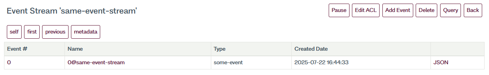

# Appending events

When you start working with EventStoreDB, it is empty. The first meaningful operation is to add one or more events to the database using one of the available client SDKs.

::: tip
Check the [Getting Started](getting-started.md) guide to learn how to configure and use the client SDK.
:::

## Append your first event

The simplest way to append an event to EventStoreDB is to create an `EventData` object and call `AppendToStream` method.

```cs
var eventData = new EventData(
  Uuid.NewUuid(),
  "some-event",
  "{\"id\": \"1\" \"value\": \"some value\"}"u8.ToArray()
);

await client.AppendToStreamAsync(
  "some-stream",
  StreamState.NoStream,
  new List<EventData> {
    eventData
  }
);
```

`AppendToStream` takes a collection of `EventData`, which allows you to save more than one event in a single batch.
 
Outside the example above, other options exist for dealing with different scenarios. 

::: tip
If you are new to Event Sourcing, please study the [Handling concurrency](#handling-concurrency) section below.
:::

## Working with EventData

Events appended to EventStoreDB must be wrapped in an `EventData` object. This allows you to specify the event's content, the type of event, and whether it's in JSON format. In its simplest form, you need three arguments:  **eventId**, **type**, and **data**.

### eventId

This takes the format of a `Uuid` and is used to uniquely identify the event you are trying to append. If two events with the same `Uuid` are appended to the same stream in quick succession, EventStoreDB will only append one of the events to the stream. 

For example, the following code will only append a single event:

```cs
var eventData = new EventData(
  Uuid.NewUuid(),
  "some-event",
  "{\"id\": \"1\" \"value\": \"some value\"}"u8.ToArray()
);

await client.AppendToStreamAsync(
  "same-event-stream",
  StreamState.Any,
  new List<EventData> {
    eventData
  }
);

// attempt to append the same event again
await client.AppendToStreamAsync(
  "same-event-stream",
  StreamState.Any,
  new List<EventData> {
    eventData
  }
);
```



### type

Each event should be supplied with an event type. This unique string is used to identify the type of event you are saving. 

It is common to see the explicit event code type name used as the type as it makes serialising and de-serialising of the event easy. However, we recommend against this as it couples the storage to the type and will make it more difficult if you need to version the event at a later date.

### data

Representation of your event data. It is recommended that you store your events as JSON objects.  This allows you to take advantage of all of EventStoreDB's functionality, such as projections. That said, you can save events using whatever format suits your workflow. Eventually, the data will be stored as encoded bytes.

### metadata

Storing additional information alongside your event that is part of the event itself is standard practice. This can be correlation IDs, timestamps, access information, etc. EventStoreDB allows you to store a separate byte array containing this information to keep it separate.

### isJson

Simple boolean field to tell EventStoreDB if the event is stored as json, true by default.

## Handling concurrency

When appending events to a stream, you can supply a *stream state* or *stream revision*. Your client uses this to inform EventStoreDB of the state or version you expect the stream to be in when appending an event. If the stream isn't in that state, an exception will be thrown. 

For example, if you try to append the same record twice, expecting both times that the stream doesn't exist, you will get an exception on the second:

```cs
var eventDataOne = new EventData(
  Uuid.NewUuid(),
  "some-event",
  "{\"id\": \"1\" \"value\": \"some value\"}"u8.ToArray()
);

var eventDataTwo = new EventData(
  Uuid.NewUuid(),
  "some-event",
  "{\"id\": \"2\" \"value\": \"some other value\"}"u8.ToArray()
);

await client.AppendToStreamAsync(
  "no-stream-stream",
  StreamState.NoStream,
  new List<EventData> {
    eventDataOne
  }
);

// attempt to append the same event again
await client.AppendToStreamAsync(
  "no-stream-stream",
  StreamState.NoStream,
  new List<EventData> {
    eventDataTwo
  }
);
```

There are three available stream states: 
- `Any`
- `NoStream`
- `StreamExists`

This check can be used to implement optimistic concurrency. When retrieving a stream from EventStoreDB, note the current version number. When you save it back, you can determine if somebody else has modified the record in the meantime.

```cs
var clientOneRead = client.ReadStreamAsync(
  Direction.Forwards,
  "concurrency-stream",
  StreamPosition.Start
);

var clientOneRevision = (await clientOneRead.LastAsync()).Event.EventNumber.ToUInt64();

var clientTwoRead     = client.ReadStreamAsync(Direction.Forwards, "concurrency-stream", StreamPosition.Start);
var clientTwoRevision = (await clientTwoRead.LastAsync()).Event.EventNumber.ToUInt64();

var clientOneData = new EventData(
  Uuid.NewUuid(),
  "some-event",
  "{\"id\": \"1\" \"value\": \"clientOne\"}"u8.ToArray()
);

await client.AppendToStreamAsync(
  "no-stream-stream",
  clientOneRevision,
  new List<EventData> {
    clientOneData
  }
);

var clientTwoData = new EventData(
  Uuid.NewUuid(),
  "some-event",
  "{\"id\": \"2\" \"value\": \"clientTwo\"}"u8.ToArray()
);

await client.AppendToStreamAsync(
  "no-stream-stream",
  clientTwoRevision,
  new List<EventData> {
    clientTwoData
  }
);
```

## User credentials

You can provide user credentials to append the data as follows. This will override the default credentials set on the connection.

```cs
await client.AppendToStreamAsync(
  "some-stream",
  StreamState.Any,
  new[] { eventData },
  userCredentials: new UserCredentials("admin", "changeit"),
  cancellationToken: cancellationToken
);
```